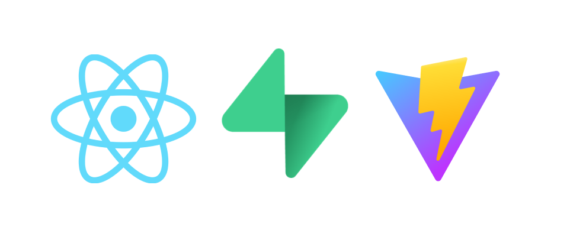

[**`🌐 App Demo`**]()

## Features which i thought that will make this a good Projects that will show case that you can use API good at using API

- Setup a Basic Google Signup Auth
- Include a feature where uses can create and manage their wishlist, watchlist, Favorite, Add Notes to some Specific Notes, share reviews online,get AI filtered and Refined reviews
- If possible we will add public reviews and ratings by the user
- Add Cookiew by 3rd party provider 
- Add Chatbot into your application by 3rd party Provider

 - API : https://developer.themoviedb.org/reference/intro/getting-started
